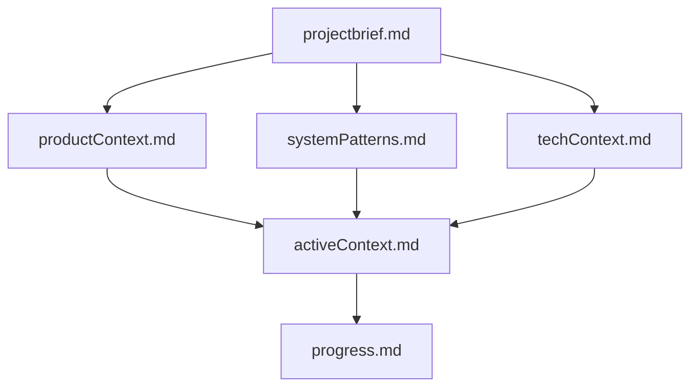
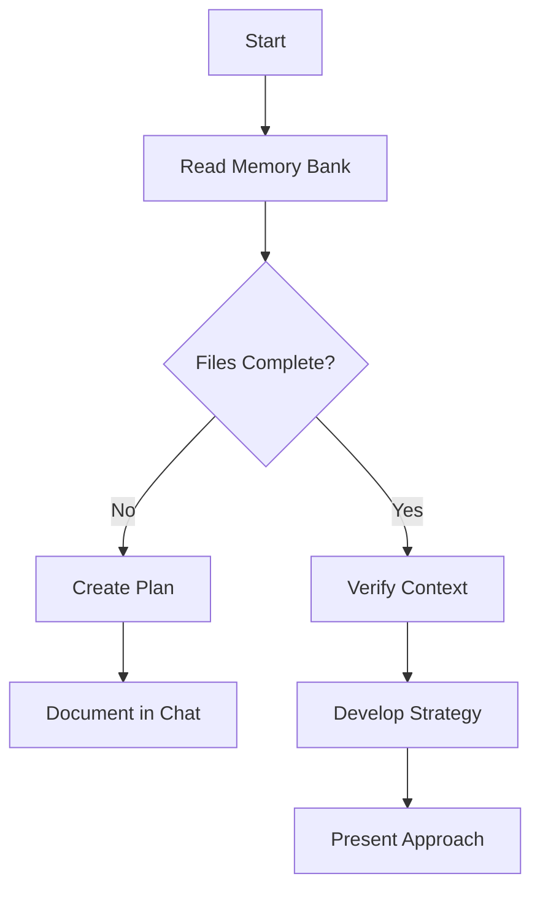
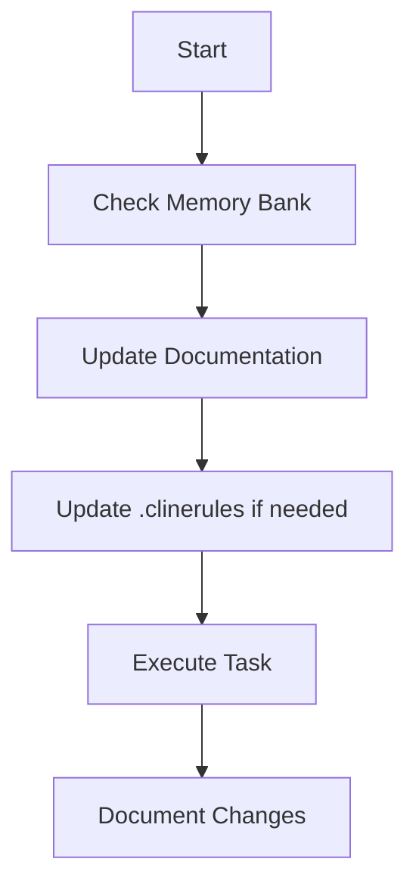
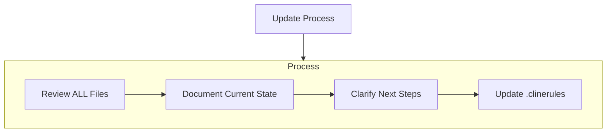
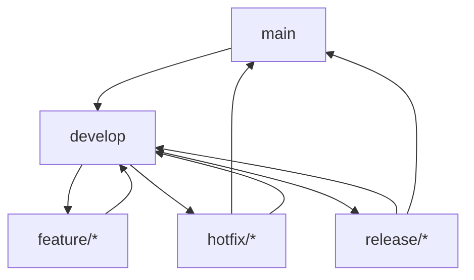
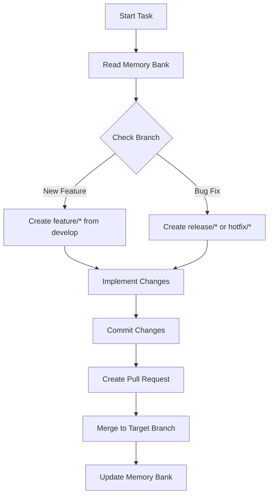

# cline-prompt
Prompt do Cline

## Como funciona o cline_prompt?

O `cline_prompt` é um sistema projetado para ajudar o Cline, um engenheiro de software cuja memória é reiniciada completamente entre sessões, a manter um fluxo de trabalho eficiente e organizado. Ele depende de uma estrutura de documentação chamada "Memory Bank" para entender o projeto e continuar o trabalho.

### Estrutura do Memory Bank

O Memory Bank é composto por arquivos Markdown organizados hierarquicamente. Cada arquivo tem um propósito específico:

- **projectbrief.md**: Documento base que define os requisitos e objetivos principais do projeto.
- **productContext.md**: Explica o motivo do projeto, os problemas que resolve e os objetivos de experiência do usuário.
- **systemPatterns.md**: Descreve a arquitetura do sistema, decisões técnicas e padrões de design.
- **techContext.md**: Lista as tecnologias usadas, configurações de desenvolvimento e restrições técnicas.
- **activeContext.md**: Foco atual do trabalho, mudanças recentes e próximos passos.
- **progress.md**: Status atual do projeto, o que já funciona e o que falta construir.

#### Hierarquia dos Arquivos

Abaixo está a hierarquia dos arquivos no Memory Bank:

### Modos de Operação

O `cline_prompt` opera em dois modos principais: **Plan Mode** e **Act Mode**.

#### Plan Mode

No modo de planejamento, o Cline lê o Memory Bank, verifica se os arquivos estão completos e desenvolve uma estratégia para a tarefa. O fluxo é o seguinte:

#### Act Mode

No modo de execução, o Cline verifica o Memory Bank, atualiza a documentação conforme necessário e executa a tarefa. O fluxo é o seguinte:

### Atualizações na Documentação

O Memory Bank é atualizado em várias situações, como após mudanças significativas ou quando solicitado pelo usuário. O processo de atualização segue estas etapas:

### GitFlow Workflow

O `cline_prompt` segue a estratégia de branching GitFlow para manter o controle de versão organizado. A estrutura de branches é a seguinte:

#### Processo de Trabalho com GitFlow

1. **Início**: Sempre crie branches a partir da base apropriada (`develop` para features, `main` para hotfixes).
2. **Implementação**: Faça commits claros e descritivos.
3. **Pull Requests**: Documente as mudanças e atualize o Memory Bank.
4. **Merge**: Após o merge, garanta que o Memory Bank reflete o estado mais recente.

### Conclusão

O `cline_prompt` é uma ferramenta poderosa que combina documentação rigorosa e estratégias de controle de versão para garantir que o Cline possa trabalhar de forma eficiente, mesmo com sua memória reiniciando entre sessões. A chave para o sucesso é manter o Memory Bank atualizado e seguir os fluxos de trabalho definidos.
